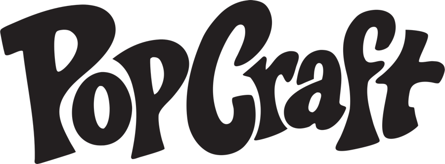
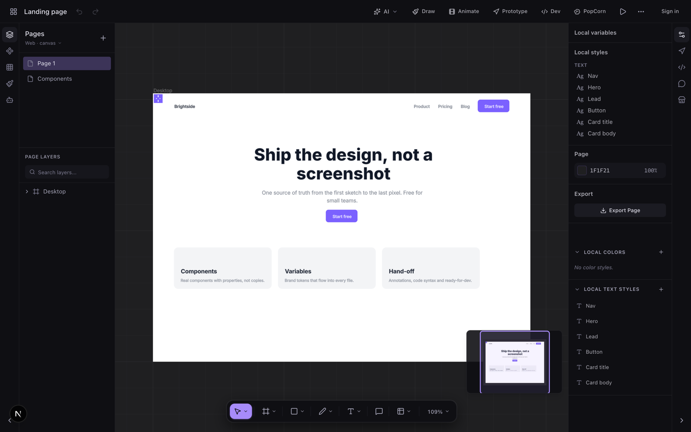
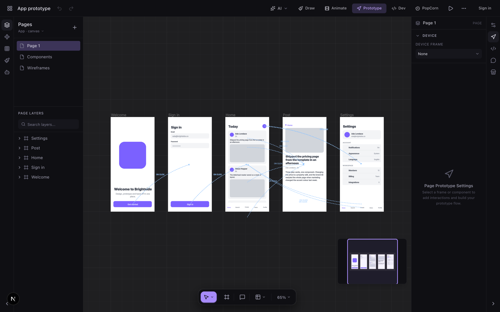
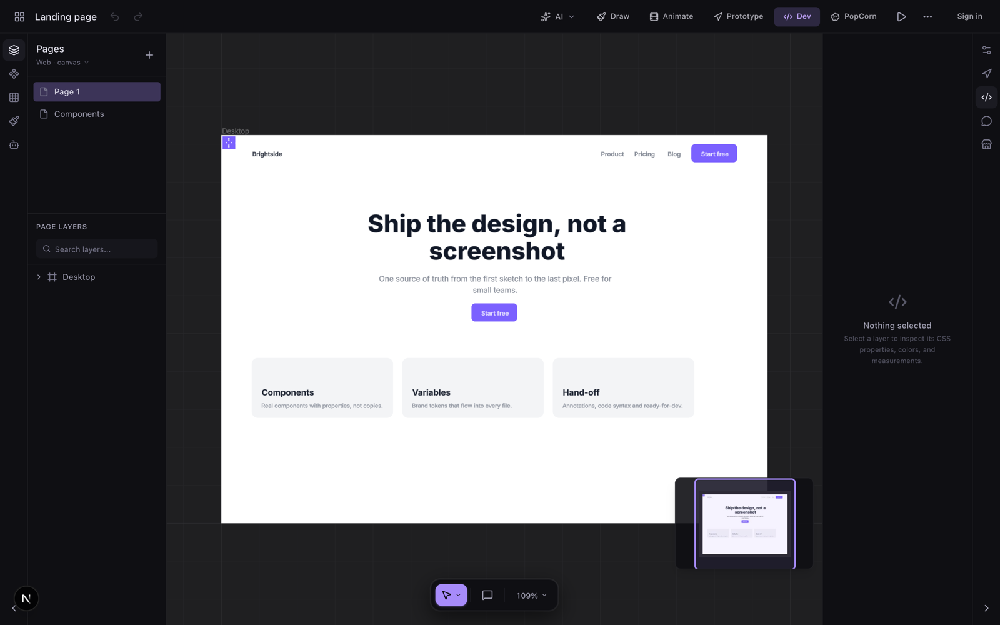
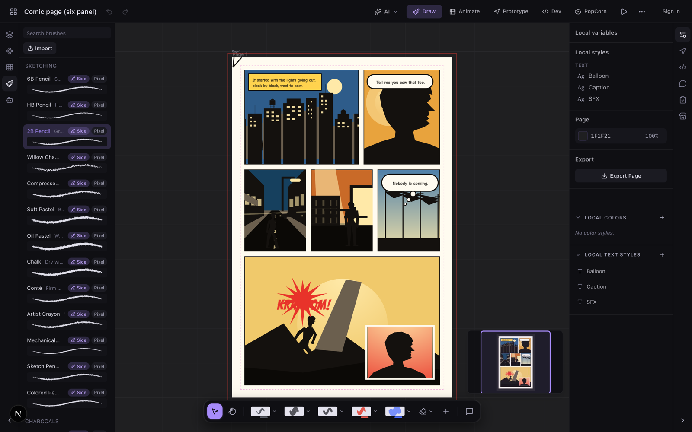
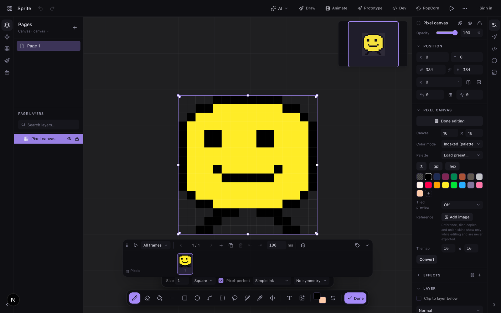
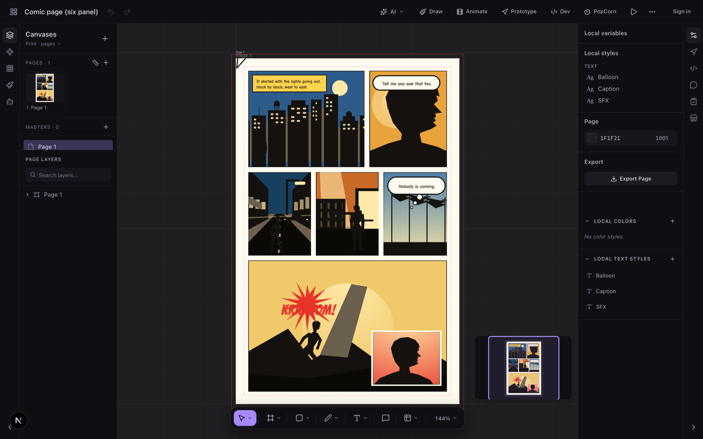
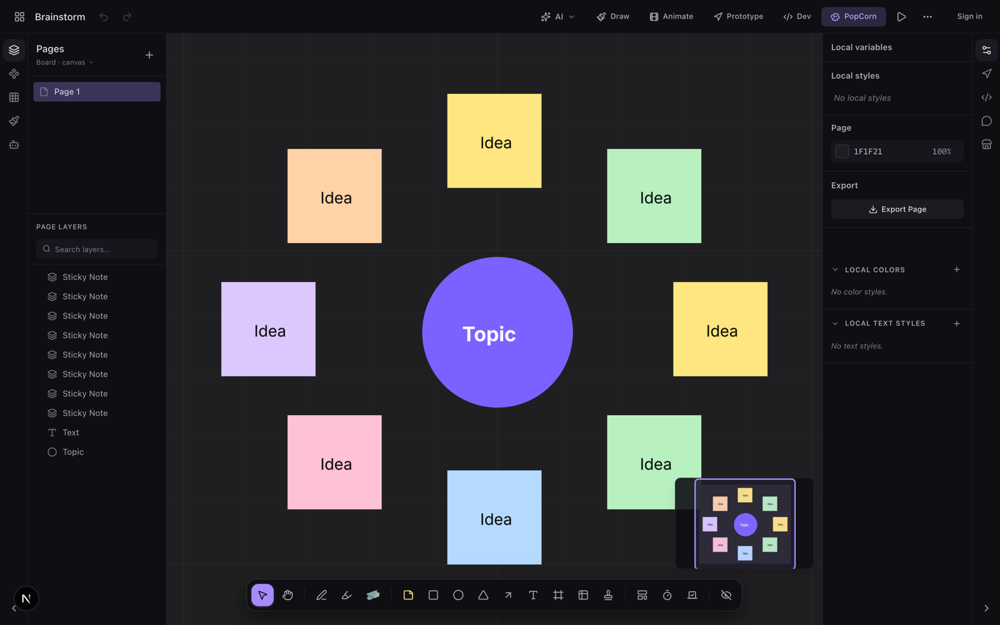

<picture>
  <source media="(prefers-color-scheme: dark)" srcset=".github/media/wordmark-white.png">
  
</picture>

### The design tool that actually pops.

Vector UI, raster painting, pixel art, comic pages and whiteboards — all in one file, all drawn on the GPU.

  

 

  

 

## ⚡ Get it

**Mac app** — grab the `.dmg` from **[the latest release](https://github.com/getpopcraft/popcraft/releases/latest)**, open it, drag PopCraft to Applications. Apple silicon, macOS 12 or later.

**Or don't install anything** — [popcraft.app](https://popcraft.app) runs the whole thing in a browser. Any browser with WebGPU: recent Chrome, Edge or Safari.

The desktop app adds tabs (one file per tab, each in its own process), and loads plugins, widgets, fonts, themes and agent skills straight out of local folders.

 

## 💥 What's in it

### ✏️ SWOOSH! — Design & prototype

Frames, auto layout, real components with variants, styles and variables. Wire screens together into something clickable, then hand it off with CSS, React, Tailwind, SwiftUI or Compose.

### 🎨 SPLAT! — Paint

93 brushes across 13 groups — pencils, inkers, calligraphy, oils, watercolour, airbrush, spraypaint, halftone grit. Pressure and tilt, stroke stabilization, perspective and isometric guides.

**Bring your own:** Procreate `.brush` and `.brushset` files import straight in.

### 👾 BEEP! — Pixel & sprite studio

A full sprite editor living inside your design file. Indexed palettes (PICO-8, DB32, Endesga 32, Game Boy), pixel-perfect strokes, symmetry, frames with onion skin, and tilemaps.

Export a GIF or a game-ready sprite sheet with an Aseprite-compatible atlas.

### 💬 KRA-KOOM! — Comics

Not a template pack. Real trim sizes the direct market prints at, panels that are actual masks, balloons with tails that point, spreads that know they're two pages on one sheet — and a live GPU halftone that exports to SVG as vector dots.

Thirty-three page layouts ship with it, from a nine-panel grid to a pulp cover.

### 🗣️ HEY! — Multiplayer

Live cursors, follow and spotlight, threaded comments with @mentions, version history with named versions, and branches. Edits merge instead of overwriting.

### 🎉 BAM! — Whiteboards

**PopCorn** boards are the same canvas in another mode: stickies, washi tape, stamps, a timer and dot voting. When the workshop's over, switch to Design and keep going in the same file.

### 🧩 KLIK! — Plugins & API

Build commands, side panels and interactive canvas widgets, publish them to the marketplace, or drive the whole thing over the REST API. Reskin the editor with a theme.

→ [Example plugins](https://github.com/getpopcraft/plugins) · [Plugin docs](https://popcraft.app/docs/plugins) · [REST API](https://popcraft.app/docs/api)

 

## 🎬 Also in the box

|  |  |
| --- | --- |
| **Templates** | Business cards, brochures, posters, resumes, slides, social, email, web, app, boards, comics |
| **Print** | Bleed, fold guides, imposition, booklets, preflight, CMYK PDF, CSV bulk-create |
| **Animation** | Build-in animations, a keyframe timeline, smart animate, springs |
| **Export** | PNG · JPG · WebP · SVG · PDF · GIF · MP4 · PPTX · sprite sheets · code |
| **Effects** | Shader fills, progressive blur, glass, noise, texture, halftone — live on the GPU |
| **Type** | Variable fonts, OpenType features, text on a path, your own font files |

 

## 📚 Docs

Everything is at **[popcraft.app/docs](https://popcraft.app/docs)** — [getting started](https://popcraft.app/docs/getting-started) · [designing](https://popcraft.app/docs/designing) · [drawing](https://popcraft.app/docs/drawing) · [pixel art](https://popcraft.app/docs/pixel-art) · [comics](https://popcraft.app/docs/comics) · [boards](https://popcraft.app/docs/boards) · [prototyping](https://popcraft.app/docs/prototyping) · [exporting](https://popcraft.app/docs/exporting) · [collaborating](https://popcraft.app/docs/collaborating).

 

## 🤔 About this repository

This repo is where the **desktop releases** live — the builds, and nothing else. PopCraft isn't open source, so there's no application code here.

- **Something broken?** [Open an issue](https://github.com/getpopcraft/popcraft/issues) or head to [support](https://popcraft.app/support).
- **Building a plugin?** The examples and API types are at [getpopcraft/plugins](https://github.com/getpopcraft/plugins).
- **Press kit?** [popcraft.app/press](https://popcraft.app/press).

Use of PopCraft is covered by the [Terms of Service](https://popcraft.app/legal/terms) and the [Privacy Policy](https://popcraft.app/legal/privacy) — see [TERMS.md](TERMS.md).

 
Made with WebGPU, and an unreasonable number of halftone dots.

